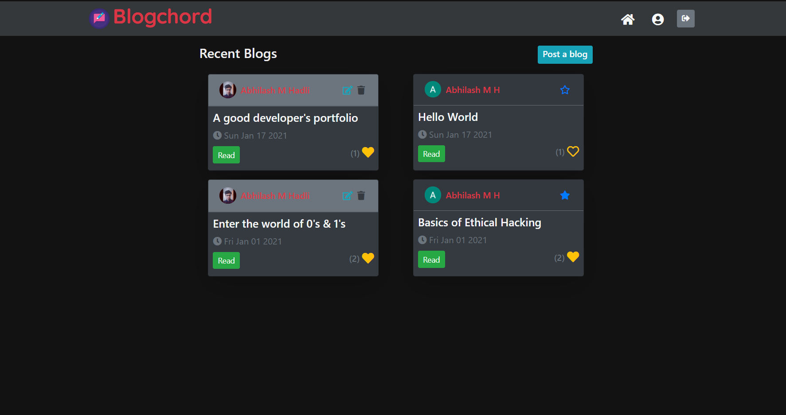
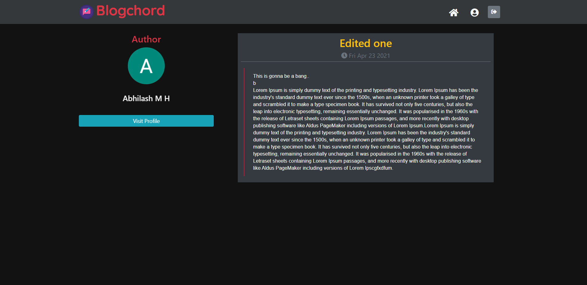
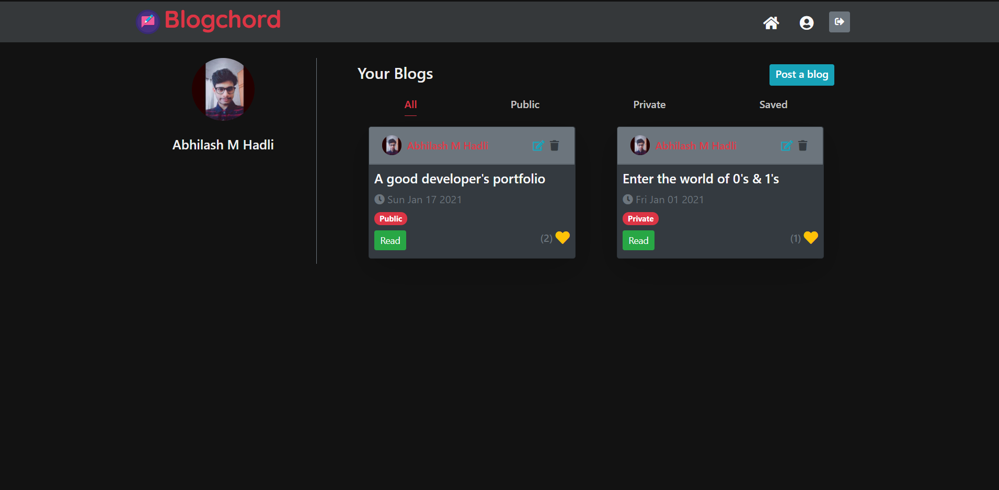
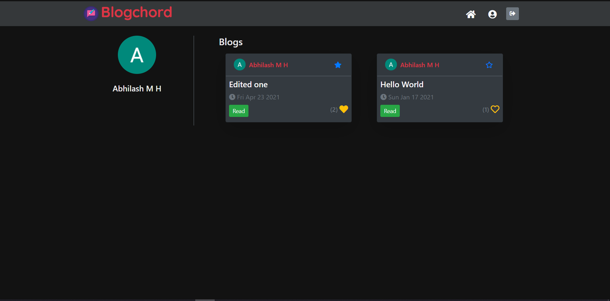

# Blogchord

> A blogging platform designed for little stories that make your day better.

### Features

1. Post/Edit your blogs
2. Set private or public status for your blogs
3. User Profile Visit
4. Save posts(Bookmark)
5. Likes
6. Alerts(in site)

<!-- - [ ] 6. Notifications
- [ ] 6. Follow requests (or) Followers/Following -->

### Technologies

1.Stack: MERN  
2.Auth: Passport OAuth 2.0

<h6>
#1 Home | #2 Read Blog | #3 Dashboard | #4 User Profile
</h6>

[Mobile App Repo](https://github.com/A7abhilash/blogchord-app)
